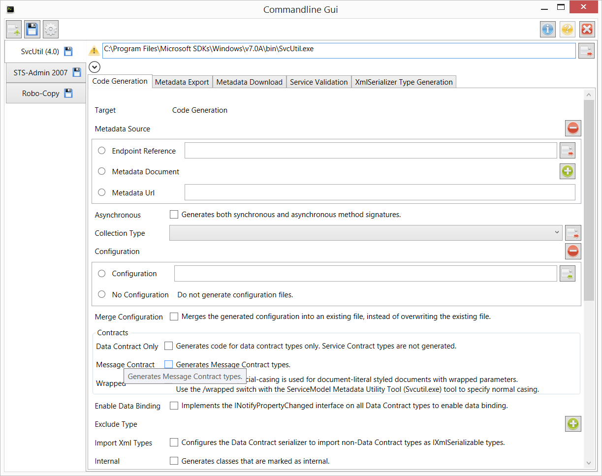
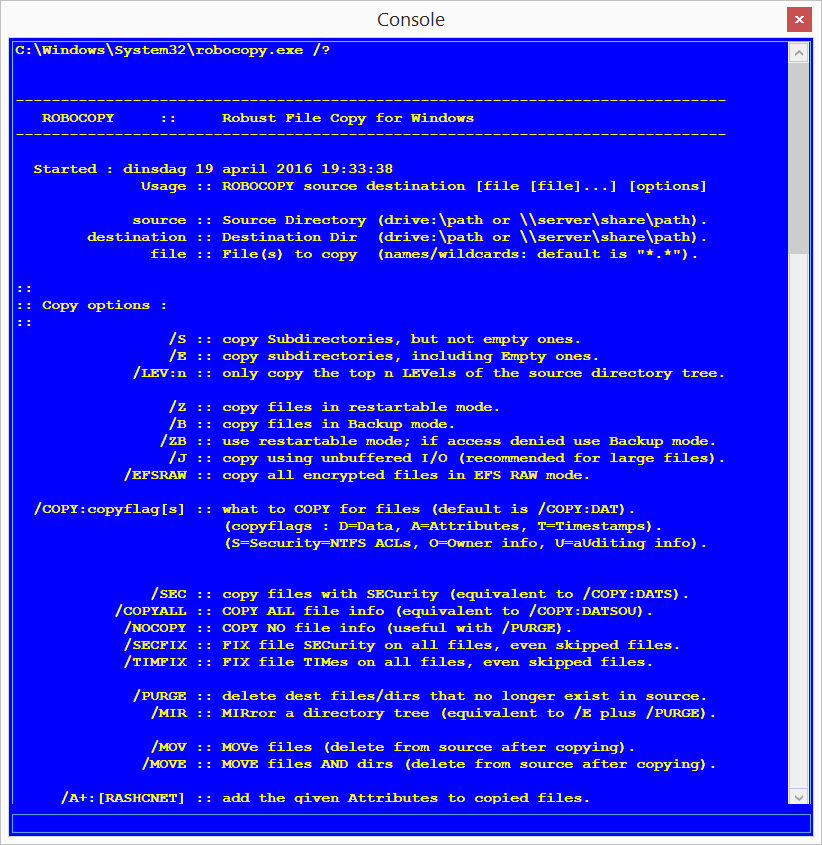

**Project Description**
An application that takes a command line argument description file (xml) and generates a Gui accordingly. For people that prefer clicking instead of typing.

# Welcome to the Command Line Gui project.
Here is an impression of the gui being generated (SvcUtil)

## What does it do?
The Command Line Gui application takes an xml file that describes the command line arguments of any executable as well as how those arguments should be presented and generates a full featured windows Gui for it. This 'form' can be filled out and saved to be reused at a later time.

## What executables are supported?
The list with executables that have a definition file can be found here (todo). But you can always create your own. Please share the file you make with community.

The executable's own help command can be invoked.

## Legal stuff
The spirit of the license is simple. You can use the releases (binaries) in any way you see fit - but you may not change them. If you change the source code or build upon that, you also have to open source your project. Commercial use is allowed following the same rules.

